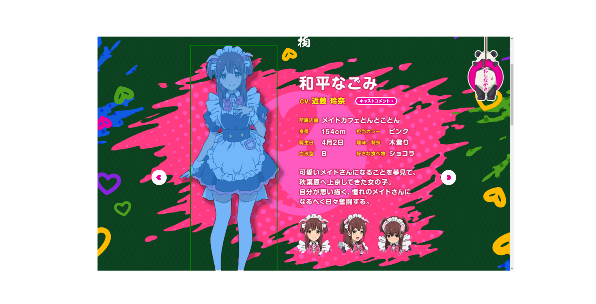
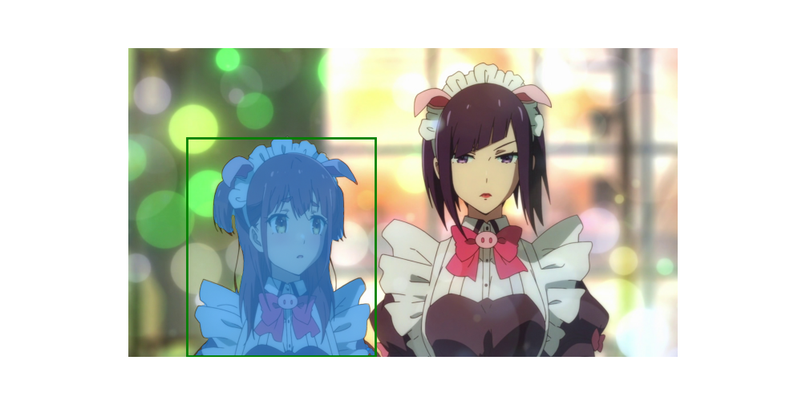

# Automatic Instance Segmentation Dataset
This project automates the creation process of instance segmentation datasets, catering to tasks related to computer vision. The pipeline utilizes several Computer Vision models, including `Clip` for image filtering based on similarity thresholds, a `Detector (Yolox)` for Object Detection, and `Segment Anything` for generating segmentation annotations.

The resultant dataset is stored in `outputs/video-file/dataset` in COCO format, suitable for training both Object segmentation and Instance segmentation tasks. The primary aim is to streamline dataset creation, particularly for segmentation masks.

This dataset can be effectively used for incremental training, employing the detector to generate new datasets for further training iterations, thereby enhancing performance.

For optimal outcomes, it's recommended to retrain the model on the `difficult` data samples, i.e., those with lower confidence levels. However, reducing confidence thresholds entails more extensive human revision of the data.





## Inputs
- **Video file**: The source video from which screenshots will be extracted.
- **Detector**: The model used for Object Detection, with `Yolox` from the `MMDetection` library being the default choice.
- **Segmentator**: The segmentation model, with `Segment Anything` from the `segment-anything` library as the default.

Place the video file in the `data/inputs` folder, and include the `video_path` in the `default_config.toml` file, preferably with the full path.


### Config
Various parameters are stored in the configuration file `default_config.toml`.
```
output_path = "data/outputs"
video_path = "YOUR-VIDEO-PATH"
screenshots_folder = "screenshots"
uniques_folder = "uniques"
folder_path = ""
similarity_threshold = 0.95

[detector]
config_file = "YOUR-DETECTOR-CONFIGURATION-FILE"
checkpoint_file = "YOUR-DETECTOR-CHECKPOINT-FILE"
conf_threshold = 0.80
classes = ['A LIST OF YOUR DETECTOR CLASSES']

[annotations]
revise_annotations = true
show_annotations = true
revised = true
annotations_file = "YOUR-ANNOTATION-FILE-ONLY-IF-REVISED-ANNOTATIONS"
images_directory = "YOUR-IMAGES-FOLDER-ONLY-IF-REVISED-ANNOTATIONS"
```

## Functionalities

The dataset creation is as follows:
1. Capture screenshots.
2. Filter unique images based on similarity using `Clip`.
3. Detect bounding boxes using `Yolox`.
4. Review annotations (using CVAT).
5. Generate segmentation masks using `Segment Anything`.

Result: An instance segmentation dataset.

### Object Detection
The process for creating an Object Detection dataset is as follows:
1. Make predictions (bounding boxes).
2. Convert predictions to annotations using the supervision library.
3. Export to `COCO` format. 
4. Update to `CVAT` format, ensuring IDs don't start from 0.


## How to Use

### Installation
```bash
git clone https://github.com/deeplearningcafe/animespeechdataset
cd animespeechdataset

```
In case of using `conda` it is recommended to create a new environment.
```bash
conda create -n animespeech python=3.11
conda activate animespeech
```

Then, install the required packages. Assuming the system has an NVIDIA GPU:
```bash
pip install -r requirements.txt
```

#### MMDetection
Install the `mmdetection` library, a package manager other than pip is required. For detailed installation instructions, refer to the [mmdetection](https://MMDetection.readthedocs.io/en/latest/get_started.html). To install the library, run the following commands:

```bash
mim install mmengine
mim install "mmcv>=2.0.0"
mim install mmdet
```

## Directory Structure
```
├── data
│   ├── inputs
│   │   ├── video-file
│   ├── outputs
│   │   ├── video-file
│   │   │   ├── screenshots
│   │   │   ├── uniques
│   │   │   ├── dataset
│   │   │   │   ├── images
│   │   │   │   ├── annotations
├── Detector
│   ├── yolox
│   ├── yolox_annotations.py
├── Preprocess
│   ├── img_sim.py
│   ├── screenshots.py
├── Segmentation
│   ├── sam_annotations.py
├── utils
│   ├── logs
├── main.py
```


## Author
[aipracticecafe](https://github.com/deeplearningcafe)

## License

This project is licensed under the MIT license. Details are in the [LICENSE](LICENSE) file.
The source code of `Automatic Instance Segmentation Dataset` itself is [MIT LICENSE](LICENSE), but the source code for each algorithm is subject to its own license. `MMdetection` and `Segment Anything` are licensed under the Apache 2.0 license.
