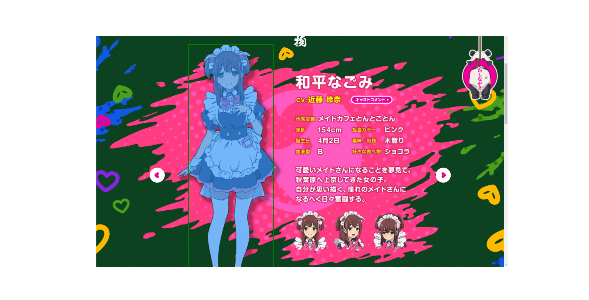

[Japanese/[English](Readme.md)]

# 自動インスタンスセグメンテーションデータセット
このプロジェクトは、コンピュータビジョンに関連するタスクに対応するために、インスタンスセグメンテーションデータセットの作成プロセスを自動化します。このパイプラインでは、`Clip`による類似度閾値に基づいた画像フィルタリング、オブジェクト検出のための`Detector（Yolox）`、およびセグメンテーションアノテーションの生成に`Segment Anything`が使用されます。

生成されたデータセットは、COCO形式で`outputs/video-file/dataset`に保存され、オブジェクトセグメンテーションおよびインスタンスセグメンテーションタスクの両方のトレーニングに適しています。主な目的は、特にセグメンテーションマスクのデータセット作成を効率化することです。

このデータセットは、インクリメンタルトレーニングに効果的に使用でき、検出器を使用して新しいデータセットを生成し、さらなるトレーニングイテレーションを行うことで性能を向上させることができます。

最適な結果を得るためには、`難しい`データサンプル、つまり信頼度が低いデータをモデルに再トレーニングすることを推奨します。ただし、信頼度の閾値を下げると、より多くの人間がデータを見直す必要があります。




## 入力
- **ビデオファイル**: スクリーンショットが抽出される元のビデオファイル。
- **検出器**: オブジェクト検出に使用されるモデル。デフォルトでは、`MMDetection`ライブラリの`Yolox`が選択されています。
- **セグメンテーター**: セグメンテーションモデル。デフォルトでは、`segment-anything`ライブラリの`Segment Anything`が選択されています。

ビデオファイルを`data/inputs`フォルダに配置し、`default_config.toml`ファイルに`video_path`を含めます。可能であれば、完全なパスを使用してください。


### 設定
様々なパラメータは、`default_config.toml`ファイルに保存されています。
```
output_path = "data/outputs"
video_path = "YOUR-VIDEO-PATH"
screenshots_folder = "screenshots"
uniques_folder = "uniques"
folder_path = ""
similarity_threshold = 0.95

[detector]
config_file = "YOUR-DETECTOR-CONFIGURATION-FILE"
checkpoint_file = "YOUR-DETECTOR-CHECKPOINT-FILE"
conf_threshold = 0.80
classes = ['A LIST OF YOUR DETECTOR CLASSES']

[annotations]
revise_annotations = true
show_annotations = true
revised = true
annotations_file = "YOUR-ANNOTATION-FILE-ONLY-IF-REVISED-ANNOTATIONS"
images_directory = "YOUR-IMAGES-FOLDER-ONLY-IF-REVISED-ANNOTATIONS"
```

## 機能
データセットの作成手順は次のとおりです：
1. スクリーンショットを撮影します。
2. `Clip`を使用して類似度に基づいて一意の画像をフィルタリングします。
3. `Yolox`を使用してバウンディングボックスを検出します。
4. アノテーションを見直します（`CVAT`を使用）。
5. `Segment Anything`を使用してセグメンテーションマスクを生成します。

結果：インスタンスセグメンテーションデータセットが生成されます。

### オブジェクト検出
オブジェクト検出データセットの作成手順は次のとおりです：
1. 予測を行います（バウンディングボックス）。
2. 監督ライブラリを使用して予測をアノテーションに変換します。
3. `COCO`形式でエクスポートします。
4. `CVAT`形式に更新し、IDが0から始まらないようにします。

## 使用方法
### インストール
```bash
git clone https://github.com/deeplearningcafe/animespeechdataset
cd animespeechdataset

```
condaを使用する場合は、新しい環境を作成することをお勧めします：
```bash
conda create -n animespeech python=3.11
conda activate animespeech
```

次に、必要なパッケージをインストールします。NVIDIA GPUを搭載していることを想定しています：

```bash
pip install -r requirements.txt
```

#### MMDetection
mmdetectionライブラリをインストールするには、pip以外のパッケージマネージャが必要です。詳細なインストール手順については、[mmdetection](https://MMDetection.readthedocs.io/en/latest/get_started.html)を参照してください。ライブラリをインストールするには、次のコマンドを実行します：

```bash
mim install mmengine
mim install "mmcv>=2.0.0"
mim install mmdet
```

## Directory Structure
```
├── data
│   ├── inputs
│   │   ├── video-file
│   ├── outputs
│   │   ├── video-file
│   │   │   ├── screenshots
│   │   │   ├── uniques
│   │   │   ├── dataset
│   │   │   │   ├── images
│   │   │   │   ├── annotations
├── Detector
│   ├── yolox
│   ├── yolox_annotations.py
├── Preprocess
│   ├── img_sim.py
│   ├── screenshots.py
├── Segmentation
│   ├── sam_annotations.py
├── utils
│   ├── logs
├── main.py
```


## Author
[aipracticecafe](https://github.com/deeplearningcafe)

## ライセンス

このプロジェクトはMITライセンスのもとで提供されています。詳細は[LICENSE](LICENSE) ファイルを参照してください。`Automatic Instance Segmentation Dataset`のソースコード自体は[MIT LICENSE](LICENSE) で提供されていますが、各アルゴリズムのソースコードはそれぞれのライセンスに従います。`MMdetection`および`Segment Anything`はApache 2.0ライセンスのもとで提供されています。
